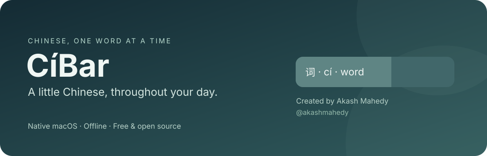
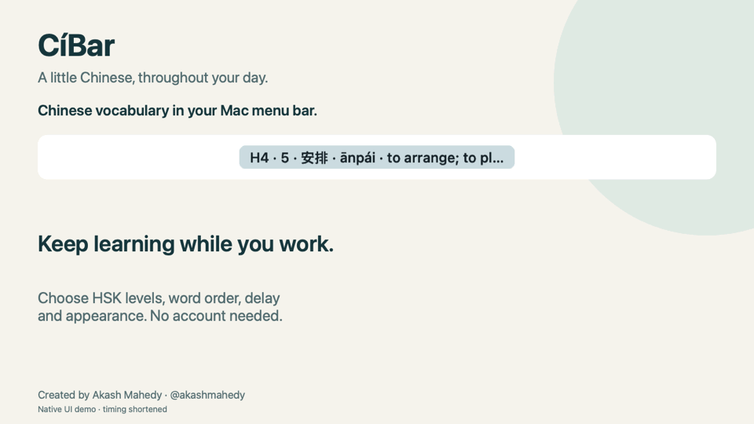

<p align="center"></p>

<p align="center">
  <a href="https://github.com/akashmahedy/CiBar/releases/latest"></a>
  
  
  <a href="LICENSE"></a>
  <a href="https://github.com/akashmahedy/CiBar/actions/workflows/build.yml"></a>
</p>

<p align="center"><strong>A free, offline macOS menu-bar app for learning Chinese, one word at a time.</strong><br />Created by <a href="https://github.com/akashmahedy">Akash Mahedy</a> · No account · No subscription · No background network calls</p>

<p align="center"><a href="#download-and-install">Download</a> · <a href="#make-it-yours">Features</a> · <a href="docs/USER-GUIDE.md">User guide</a> · <a href="docs/DATA.md">Vocabulary & sources</a> · <a href="#build-from-source">Build</a></p>

[Project website](https://akashmahedy.github.io/CiBar/) · [Mac stable download](https://github.com/akashmahedy/CiBar/releases/tag/v1.0.2) · [Windows 11 preview](https://github.com/akashmahedy/CiBar/releases/tag/v1.1.0-preview.1)



*Native Mac UI demo with timing shortened. Mac is stable; Windows 11 is a preview. [25-second video](docs/assets/demo-landscape.mp4) · [Portrait video for social sharing](docs/assets/demo-vertical.mp4).*

## Chinese that stays in view

CíBar puts Hanzi, Pinyin and a short English meaning in your menu bar. A gentle fill shrinks smoothly until the next word. Click to read the full meaning, a sourced example and its attribution. The timer pauses while you read and resumes when you close the card.

| Light appearance | Dark appearance |
| --- | --- |
|  |  |

*Native rendered previews. Long text is shortened in the menu bar; the word card keeps the full text.*

## Download and install

1. Open [Releases](https://github.com/akashmahedy/CiBar/releases/latest).
2. Download **CiBar-Apple-Silicon.zip** for an M-series Mac, or **CiBar-Intel.zip** for an Intel Mac.
3. Unzip, drag the app into **Applications**, then open it. CíBar appears in the menu bar without a Dock icon.
4. Right-click the word → **Settings…** to choose levels, ranges, delay and appearance.

Requires macOS 13+. The Apple Silicon app is arm64-only and does not need Rosetta. The Intel app is separate. Releases use a local ad-hoc signature and are **not Apple-notarized**. If macOS blocks a download, review the source and use the normal **Privacy & Security → Open Anyway** flow. Do not disable Gatekeeper globally.

## Windows 11 preview

A native **C++20 / Win32** edition displays a movable vocabulary pill **above the taskbar**. It includes DirectComposition countdown fill, the same 5400-word pack, study and appearance controls, full word cards, Favorites, and Mac-compatible version 1 backups. Created by **Akash Mahedy · @akashmahedy**.

Download [CiBar-Windows-x64.zip — prerelease](https://github.com/akashmahedy/CiBar/releases/tag/v1.1.0-preview.1), extract the entire folder and run `CiBar.exe`. Intel/AMD x64, Windows 11; no .NET, Electron or separate C++ runtime installation. Default HSK4, sequential, 45 seconds, adaptive width capped at 260.

**Preview status:** automated native build/core tests and Mac backup compatibility are checked in [Windows CI](https://github.com/akashmahedy/CiBar/actions/workflows/windows.yml). Real Windows 11 GUI, display-scaling and five-minute resource measurements remain pending. Mac screenshots and performance figures on this page describe the Mac edition. See the [Windows guide](Windows/README.md), [verification checklist](Windows/VERIFICATION.md), and [Windows source](Windows/). The Mac edition remains the current stable release.

## Make it yours

| Study | Appearance | Your library |
| --- | --- | --- |
| HSK 1–6, multiple levels together | Toggle level, serial, Hanzi, Pinyin and meaning | Search the full word list |
| Independent inclusive serial ranges | Smooth fill and background toggles | Favorites and favorites-only playback |
| Sequential or random without repeats per cycle | Adaptive or fixed width, 80–600 pt cap | Import UTF-8 CSV / TSV |
| Adjustable time per word | Font size 9–18 pt | Copy words and open a dictionary |
| Previous, next, jump, pause and resume | Ocean, Sage, Plum, Amber, Graphite, Custom | Export and restore data, settings and progress |
| Reading card pauses the timer | Soft, Balanced or Strong fill contrast | Optional launch at login |

Default: **HSK4 · sequential · 45 seconds · adaptive width capped at 260 pt**. No countdown number. Reduce Motion uses a one-second fill update instead of continuous animation. The menu bar can still hide items when crowded, especially near a notch; reduce the width or hide English if needed.

## Which HSK list?

The bundled pack follows the **2025 HSK 3.0 exam syllabus**, with **5400 words** across levels 1–6. Level-local numbering and headword order were checked against the official syllabus.

| Level | New words in this level | Total through this level |
| --- | ---: | ---: |
| 1 | 300 | 300 |
| 2 | 200 | 500 |
| 3 | 500 | 1,000 |
| 4 | 1,000 | 2,000 |
| 5 | 1,600 | 3,600 |
| 6 | 1,800 | 5,400 |

Select levels **1–4** to study all 2000 words through HSK4. Selecting only **4** plays its 1000 new entries.

**3071 words have offline examples.** Most sentence Pinyin is automatic transliteration and is labelled accordingly; polyphonic readings and neutral tones can be wrong. Some examples illustrate a different sense. Missing examples are stated explicitly. Headword verification does not certify every translation. See [data sources, attribution and limits](docs/DATA.md).

## Lightweight by design

CíBar uses native AppKit views and one Core Animation fill layer, without generating animation images or running a helper process per frame. On one Apple M1 Mac, a five-minute default-playback sample averaged **0.74% of one CPU core** and **48.55 MiB** physical memory footprint. Peaks and methodology are in [Performance](docs/PERFORMANCE.md). These measurements are not guarantees for every Mac; compositor power and battery life were not isolated.

## Build from source

Install Apple's Command Line Tools, then:

```sh
git clone https://github.com/akashmahedy/CiBar.git
cd CiBar
zsh Tools/build.sh
```

The prepared word pack is included; no third-party packages or data downloads are needed. The script compiles an optimized arm64 app, applies an ad-hoc signature and runs self-tests. Output: `../outputs/CiBar.app`.

```sh
zsh Tools/build.sh --intel           # separate Intel build; not run on an M-series Mac
zsh Tools/release.sh                 # clean public ZIPs, without your personal data
```

Tests cover multilevel ranges, sequence wrapping, random cycles, pause reasons, delay changes, jump, favorites, import rejection, backup roundtrips, recovery-write failure, adaptive width, animation and palette contrast. Physical Intel hardware and the minimum supported macOS version have not been tested locally; CI builds and tests on GitHub's Apple Silicon and Intel runners.

## Privacy, credit and licenses

Settings, favorites and progress stay in `~/Library/Application Support/CiBar/`. CíBar has no analytics, cloud sync or background network requests. Dictionary and example-source links open public pages only when clicked. Your backup files can contain custom vocabulary and progress; keep them private unless you intend to share them.

**Created by Akash Mahedy · [@akashmahedy](https://github.com/akashmahedy)**, with AI-assisted implementation. App code and original visual assets are [MIT](LICENSE). Vocabulary and sentence examples have separate Creative Commons licenses; the MIT license does not relicense them. See [ATTRIBUTIONS](Resources/ATTRIBUTIONS.txt).

[Contributions](CONTRIBUTING.md), useful bug reports and sourced vocabulary corrections are welcome. Please do not include personal backup files or credentials in issues.
